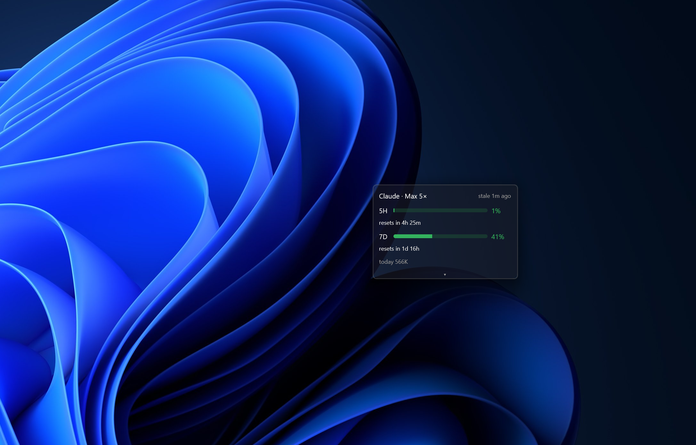

# claude-usage

A small, always-on-top, **see-through glass** desktop widget for **Windows** (Rust)
that shows how close you are to your Claude limits — your real **5-hour** and
**7-day** rate-limit utilization, color-coded, plus local token detail and an
activity heatmap.



- **At a glance:** two color-coded bars (5H / 7D) with reset countdowns — green
  under your warn threshold, amber, red near the limit.
- **Details on demand:** click the **▾** chevron for top projects, an activity
  heatmap, and live source/diagnostics.
- **Glass:** the window is genuinely transparent — your wallpaper shows through.
  An **opacity** control (in Details) dials it from fully see-through to a solid
  card. Drag it anywhere by the header; it remembers where you put it.
- **Zero-network option:** register the bundled status-line helper and the widget
  reads your real quota from a local cache — no API calls.

## Credits

- Inspired by **[bozdemir/claude-usage-widget](https://github.com/bozdemir/claude-usage-widget)**
  — the original Python Claude usage widget that sparked this.
- GUI built on **[longbridge/gpui-component](https://github.com/longbridge/gpui-component)**
  and **[gpui](https://github.com/zed-industries/zed)** (Zed's Rust GUI framework).

## How it works

Two crates, split so the interesting part — getting the numbers right — is pure
and unit-tested without any GUI:

| Crate | What | Builds with |
|---|---|---|
| **`usage-core`** | All data + logic: quota sources, incremental JSONL token parsing, reconciliation, the `UsageSnapshot` model, config, the status-line helper. **No GUI.** | stable Rust — **no CMake** |
| **`usage-widget`** | The gpui + gpui-component GUI shell (transparent window, bars/rings, Details, always-on-top, drag, start-on-login). A thin cap over `usage-core`. | Rust 1.96 + **CMake** + MSVC |

**Data flow:**

1. A **collector** runs on its own OS thread (so blocking file/network IO never
   touches the UI thread) and publishes an immutable `UsageSnapshot` into a shared
   slot. The GUI repaints ~1 Hz, so countdowns tick and fresh snapshots appear.
2. **Quota** (the headline %) is server-side only. It comes from either:
   - the local **status-line cache** (`~/.claude/widget-cache/ratelimits.json`,
     preferred when fresh — no network), or
   - the **OAuth usage endpoint** `GET /api/oauth/usage` (fallback; uses the token
     in `~/.claude/.credentials.json`).
   The two are reconciled in `collector::Collector::tick` (fresh cache wins).
3. **Token detail / heatmap** is parsed incrementally from
   `~/.claude/projects/*/*.jsonl` — a per-file byte cursor, dedup on
   `(message.id, requestId)`, `subagents` excluded, bucketed by UTC day.

**The glass** is genuine window transparency, not a DWM backdrop: the gpui window
uses `WindowBackgroundAppearance::Transparent`, and the gpui-component `Root`
instance is given a transparent background so the desktop shows through. The
`opacity` setting is a dark scrim drawn over it for
legibility — `0.0` = fully see-through, `1.0` = solid card. (A true *frosted*
Mica/Acrylic backdrop was attempted and shelved — see the roadmap.)

## Quick start (core only — no CMake)

`usage-core` is the only **default workspace member**, so the bare commands below
build just the pure-logic crate and never pull in the gpui widget (no CMake):

```powershell
# Run the full test suite (pure logic)
cargo test

# Print a snapshot from your real local ~/.claude data
cargo run --example snapshot

# Build the status-line helper
cargo build --release --bin statusline
# -> target/release/statusline.exe
```

### Wire up live quota with zero network (recommended)

Register the helper as Claude Code's status line in `~/.claude/settings.json`
(use the absolute path to the `statusline.exe` you built):

```json
{
  "statusLine": {
    "type": "command",
    "command": "C:\\path\\to\\statusline.exe"
  }
}
```

Every assistant message then refreshes `~/.claude/widget-cache/ratelimits.json`
with your real 5h/7d utilization, which the widget reads with no API call.

## Building the widget (GUI)

1. Prerequisites: **CMake** (`winget install Kitware.CMake`), **Rust 1.96**
   (`rustup toolchain install 1.96.0`, pinned in `rust-toolchain.toml`), and MSVC
   "Desktop development with C++".
2. `cargo build --release --locked -p claude-usage-widget`
   → `target/release/claude-usage-widget.exe` (~8 MB).

> The gpui dependencies are git-only and intentionally omit a `rev` in
> `Cargo.toml` (mixing `zed#sha` with `zed?rev=sha#sha` would pull two
> incompatible `gpui` crates). Reproducibility comes from the **committed
> `Cargo.lock`** — always build with `--locked`.

## Project structure

```
claude-usage/
├─ Cargo.toml / Cargo.lock        # Cargo workspace (one lockfile pins the gpui git deps)
├─ README.md / LICENSE (MIT)
├─ docs/                          # design spec, plan, and glass-backdrop research
├─ crates/                        # the shipped code
│  ├─ usage-core/                 # pure logic — unit-tested, no GUI
│  │  ├─ src/{model,timeutil,config,collector,statusline_cmd}.rs
│  │  ├─ src/sources/{mod,oauth,statusline,jsonl}.rs
│  │  ├─ src/bin/statusline.rs    # the registerable status-line helper
│  │  └─ examples/snapshot.rs     # real-data demo
│  └─ usage-widget/               # gpui GUI shell
│     ├─ src/main.rs
│     ├─ src/ui/{mod,theme}.rs    # rendering + level→color
│     └─ src/win/{mod,topmost,autostart}.rs   # Windows glue (always-on-top, HKCU Run)
└─ tools/                         # dev-only, not shipped (see tools/README.md)
   ├─ icongen/                    # SVG → multi-size icon.ico
   └─ glass-capture/              # DXGI screen-capture → PNG (verifies the glass)
```

## Roadmap

- **Frosted (Mica/Acrylic) glass — next phase.** A real DWM backdrop was
  prototyped via a companion window and shelved because it composites
  inconsistently (works over the wallpaper, dark over plain windows) and added
  fragile complexity. The findings and a path to doing it properly are in
  [`docs/glass-backdrop-research.md`](docs/glass-backdrop-research.md).

## License

MIT © 2026 Ozgur Oz — see [LICENSE](LICENSE).
